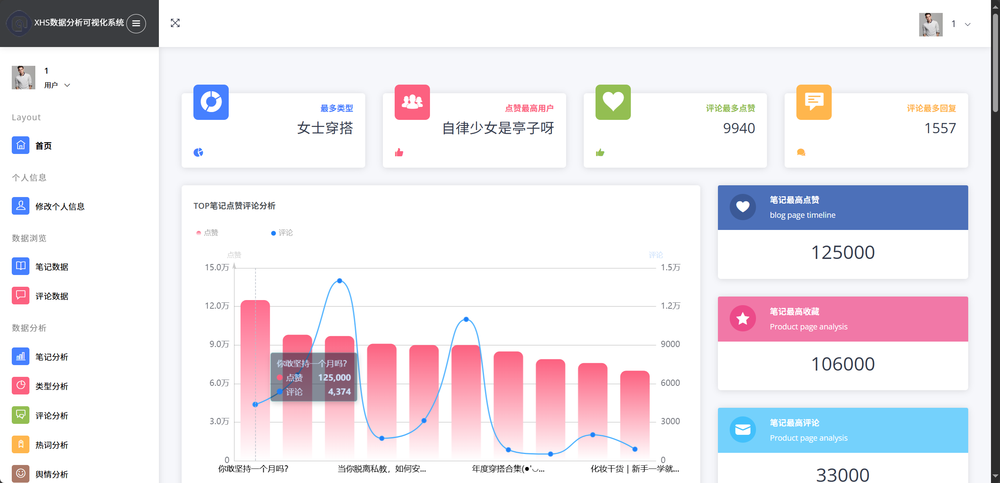
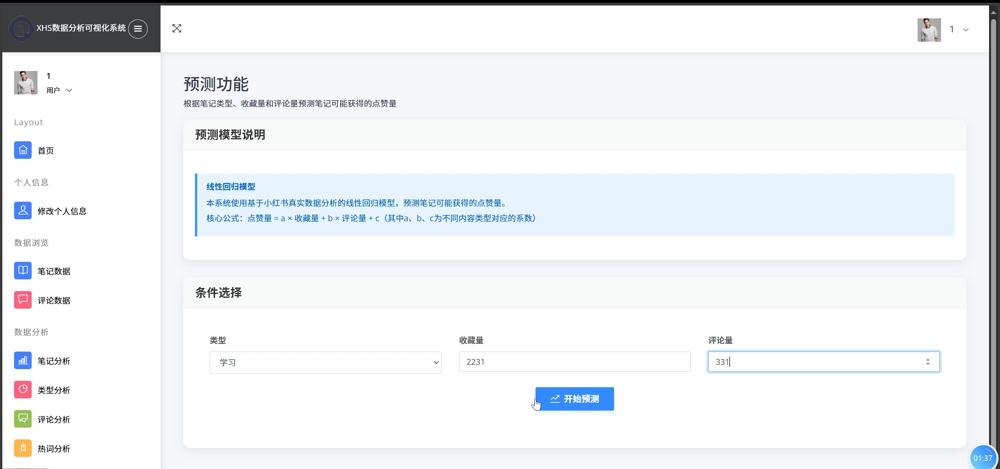
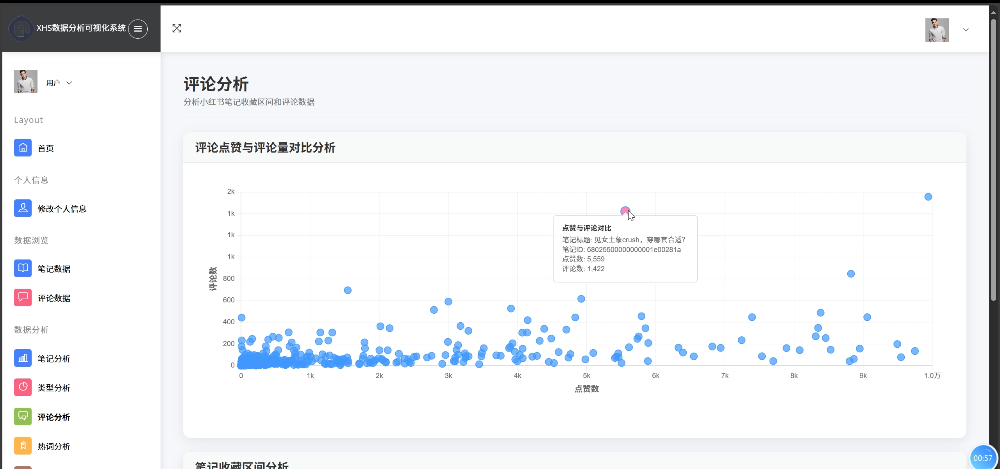
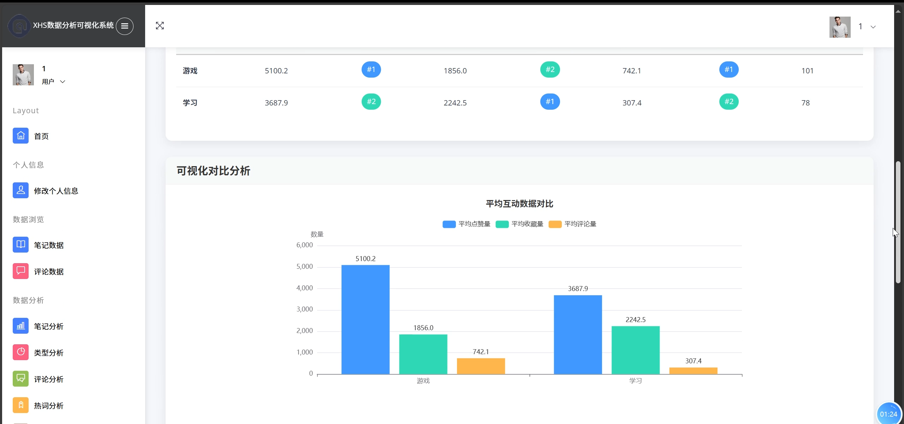
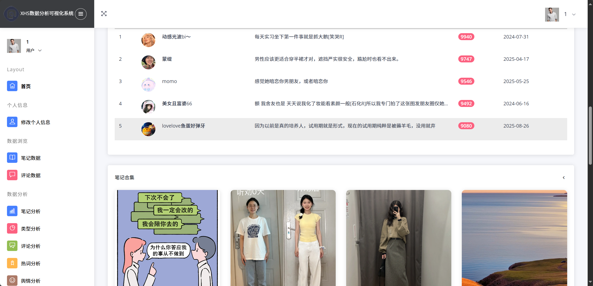
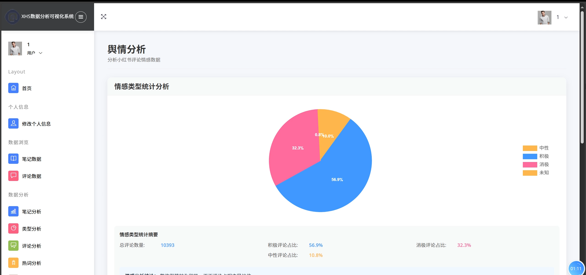
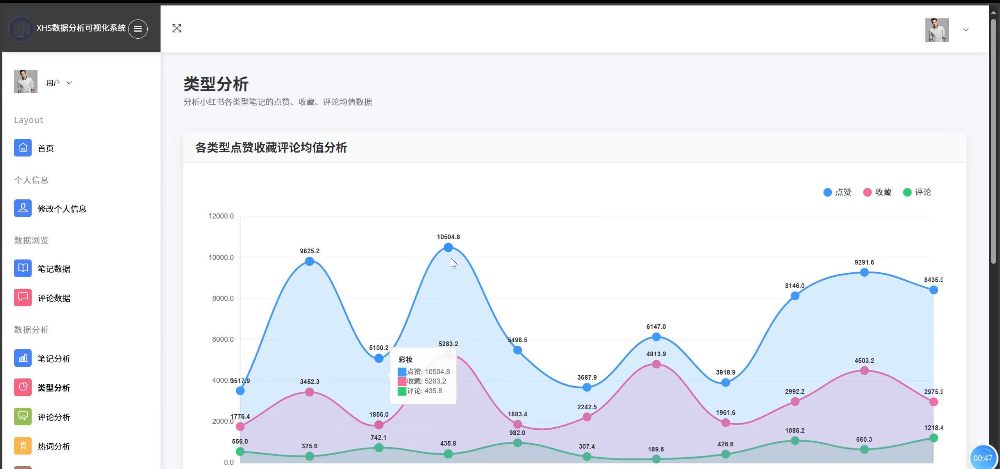
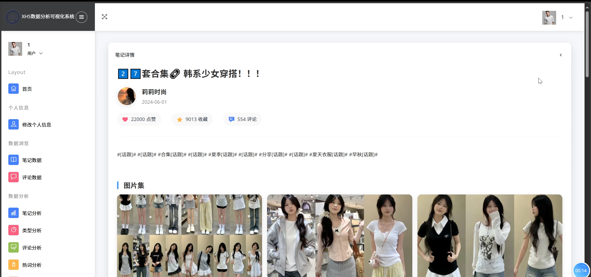

## 计算机毕业设计PySpark+Hive+Django小红书评论情感分析 小红书笔记可视化 小红书舆情分析预测系统 大数据毕业设计(源码+

完整LW+PPT+详细讲解)

## 要求
### 源码有偿！一套(论文 PPT 源码+sql脚本+教程)

### 
### 加好友前帮忙start一下，并备注github有偿26小红书分析
### 我的QQ号是1957722142 或者 1679232425 或者798059319或者2827724252 或者微信:biyesheji1698 或者 bysj2023nb

# 

### 加qq好友说明（被部分 网友整得心力交瘁）：
    1.加好友务必按照格式备注
    2.避免浪费各自的时间！
    3.当“客服”不容易，repo 主是体面人，不爆粗，性格好，文明人。
## 主要功能 
###  创新点：大模型、预测算法、可视化、爬虫、装逼虚拟机敲命令吊打导师看不懂
```
1 绪 论
1.1 课题研究背景
随着移动互联网的快速发展和社交媒体平台的兴起，小红书作为国内领先的生活方式分享平台，已经成为年轻用户获取消费决策信息的重要渠道。平台每日产生海量的用户生成内容（UGC），包括图文笔记、视频内容、用户评论等多种形式的数据。这些数据蕴含着丰富的用户行为模式、消费趋势和内容偏好信息，对于内容创作者、品牌方和平台运营具有重要的商业价值。

然而，传统的数据分析方法面临着数据量大、处理速度慢、分析维度单一等挑战。小红书平台的数据具有典型的大数据特征：数据量庞大、更新频率高、数据类型多样化。传统的关系型数据库和单机处理方式已经无法满足实时性和准确性的要求。同时，现有的分析工具大多局限于简单的统计分析，缺乏深度的语义分析和预测能力。

Apache Spark作为新一代的分布式计算框架，具有内存计算、容错性强、API丰富等优势，为大规模数据处理提供了高效的解决方案。结合自然语言处理技术和机器学习算法，能够实现对小红书数据的深度挖掘和智能分析。因此，构建基于Spark的小红书数据分析系统具有重要的现实意义和技术价值。

1.2 课题研究的目的、意义
1.2.1 研究目的
本课题旨在构建一个基于Apache Spark的小红书数据分析系统，通过分布式计算技术实现对小红书平台数据的高效采集、处理和分析。具体研究目的包括：

第一，设计并实现高效的数据采集机制，能够自动化获取小红书平台的笔记内容、用户信息、评论数据等多维度信息，建立完整的数据采集流水线。第二，构建基于Spark的分布式数据处理架构，实现对海量数据的快速清洗、转换和存储，提升数据处理的效率和可靠性。第三，开发多维度的数据分析功能，包括内容热度分析、用户行为分析、情感倾向分析、热词提取分析等，为用户提供全面的数据洞察。第四，实现基于机器学习的预测分析功能，通过历史数据训练模型，预测笔记的潜在热度和用户互动情况。第五，构建直观的数据可视化界面，通过图表、仪表盘等形式展示分析结果，提升用户体验和决策效率。

1.2.2 研究意义
本研究具有重要的理论意义和实践价值。在理论意义方面，本研究探索了Spark分布式计算框架在社交媒体数据分析领域的应用模式，为大数据处理技术在内容分析场景下的应用提供了理论参考和技术路径。通过结合自然语言处理、机器学习等技术，形成了完整的社交媒体数据分析技术体系。

在实践意义方面，系统为小红书内容创作者提供了数据驱动的内容优化建议，帮助创作者了解用户偏好、优化内容策略、提升内容质量。为品牌方和营销人员提供了竞品分析和市场趋势洞察，支持营销决策和品牌推广策略制定。为平台运营人员提供了用户行为分析和内容质量评估工具，有助于平台内容生态的健康发展。

在社会意义方面，系统促进了数据科学技术在内容创作领域的应用，推动了传统内容产业的数字化转型。通过提供开放的数据分析能力，降低了数据分析的技术门槛，使更多的个人和小微企业能够享受到大数据分析的价值。

在经济意义方面，系统提升了内容创作和营销活动的精准度和效率，减少了盲目投入和资源浪费。通过数据驱动的决策支持，能够提高内容的商业转化率，创造更大的经济价值。

1.3 课题的国内外研究现状和发展动态
1.3.1 国外研究现状
在国外，社交媒体数据分析技术起步较早，已经形成了相对成熟的技术体系和商业应用。Twitter、Facebook、Instagram等平台都建立了完善的数据分析基础设施，为第三方开发者提供了丰富的API接口和分析工具。

在技术层面，Apache Spark自2014年发布以来，已经成为大数据处理的主流框架。Spark的内存计算能力和丰富的机器学习库（MLlib）为社交媒体数据分析提供了强大的技术支撑。国外的研究主要集中在算法优化、实时流处理、图计算等方面，形成了完整的技术生态。

在应用层面，国外已经涌现出众多成功的社交媒体分析产品，如Hootsuite Insights、Sprout Social、Brandwatch等，这些产品在情感分析、趋势预测、影响力评估等方面具有较高的技术水平。同时，学术界也产生了大量高质量的研究成果，在顶级会议和期刊上发表了众多相关论文。

1.3.2 国内研究现状
在国内，随着移动互联网的快速发展，社交媒体数据分析技术也得到了快速发展。清华大学、北京大学、中科院等科研院所在大数据处理、自然语言处理等领域取得了重要进展。

在技术应用方面，阿里巴巴、腾讯、百度等互联网巨头都建立了自己的大数据分析平台，在用户行为分析、内容推荐、广告投放等方面积累了丰富经验。同时，也涌现出了一批专业的数据分析公司，如神策数据、GrowingIO、友盟+等，为企业提供专业的数据分析服务。

然而，在小红书等生活方式分享平台的数据分析方面，国内的研究相对较少，大多数研究集中在微博、微信等传统社交媒体平台。针对小红书平台特有的图文结合、购物导向、社区化运营等特点的分析工具和方法还有待进一步发展。

1.3.3 发展趋势
从技术发展趋势来看，社交媒体数据分析正朝着实时化、智能化、个性化的方向发展。实时流处理技术使得数据分析能够实现秒级响应，满足实时监控和预警的需求。人工智能技术的发展，特别是深度学习和大语言模型的应用，使得文本理解和情感分析的准确性大幅提升。

从市场应用前景来看，随着内容经济的快速发展，对数据分析的需求将持续增长。品牌方对精准营销的需求、创作者对内容优化的需求、平台方对生态治理的需求，都为数据分析技术提供了广阔的应用空间。

从发展机遇来看，国家对数字经济的大力支持、5G技术的普及应用、云计算基础设施的完善，都为大数据分析技术的发展创造了良好的外部环境。同时，用户对个性化服务的需求不断提升，也为数据分析技术的应用提供了内在动力。

从面临的挑战来看，数据隐私保护法规的完善对数据采集和使用提出了更高要求，技术门槛的提升对开发者的能力提出了新的挑战，市场竞争的加剧对产品的差异化和创新能力提出了更高标准。

1.4 研究内容
本研究的主要内容包括以下几个方面：

首先是系统架构设计与技术选型研究。基于小红书数据的特点和分析需求，设计分布式数据处理架构，选择合适的技术栈和开发框架。重点研究Spark在数据处理中的应用模式，Django在Web开发中的最佳实践，以及各组件之间的集成方案。

其次是数据采集与预处理技术研究。设计高效的网络爬虫系统，实现对小红书平台数据的自动化采集。研究数据清洗、去重、格式化等预处理技术，确保数据质量和一致性。同时研究数据存储优化策略，提升数据访问效率。

第三是分布式数据分析算法研究。基于Spark框架实现多维度的数据分析功能，包括统计分析、关联分析、聚类分析等。重点研究自然语言处理技术在内容分析中的应用，实现情感分析、热词提取、主题挖掘等功能。

第四是机器学习预测模型研究。基于历史数据构建预测模型，实现对笔记热度、用户互动等指标的预测。研究特征工程、模型选择、参数优化等关键技术，提升预测准确性和稳定性。

最后是可视化展示与用户交互研究。设计直观的数据可视化界面，研究图表设计、交互逻辑、响应式布局等前端技术。同时研究用户体验优化策略，提升系统的易用性和实用性。

1.5 论文结构安排
本论文共分为六个章节，各章节的主要内容和逻辑关系如下：

第一章为绪论，主要介绍课题的研究背景、目的意义、国内外研究现状和发展动态，明确研究内容和论文结构安排。通过对相关领域的深入调研，为后续研究奠定理论基础。

第二章为关键技术，详细介绍系统涉及的核心技术，包括Apache Spark分布式计算技术、Django Web开发框架、网络爬虫技术、自然语言处理技术、数据可视化技术等。重点阐述各技术的原理、特点和在本系统中的应用方式。

第三章为系统分析与设计，从系统工程的角度进行需求分析和架构设计。包括系统总体设计、功能模块设计、数据库设计等内容。通过系统化的设计方法，确保系统的完整性和可扩展性。

第四章为系统实现，详细介绍各功能模块的具体实现过程，包括关键算法、核心代码、技术难点和解决方案。通过实际的开发实践，验证设计方案的可行性和有效性。

第五章为系统测试，从功能测试和性能测试两个维度对系统进行全面验证。通过科学的测试方法和详细的测试用例，确保系统的质量和稳定性。

第六章为总结与展望，总结研究成果和创新点，分析存在的不足，提出未来的改进方向和发展前景。

2 关键技术
2.1 Apache Spark分布式计算技术
Apache Spark是本系统的核心计算引擎，为大规模数据处理提供了高效的分布式计算能力。Spark采用内存计算模式，相比传统的MapReduce框架，在迭代计算和交互式查询方面具有显著的性能优势。本项目中，Spark主要用于小红书数据的ETL处理、统计分析和机器学习任务。

Spark的核心优势在于其弹性分布式数据集（RDD）抽象和DataFrame API。RDD提供了容错性和并行处理能力，能够自动处理节点故障和数据恢复。DataFrame API则提供了类似SQL的操作接口，使得数据处理更加直观和高效。在本系统中，通过Spark SQL可以直接对小红书数据进行复杂的聚合分析和关联查询。

2.1.1 Spark SQL数据处理
Spark SQL是Spark的结构化数据处理模块，提供了SQL查询接口和DataFrame API。在本项目中，Spark SQL主要用于数据清洗、转换和聚合分析。通过SQL语句可以方便地实现复杂的数据操作，如多表关联、分组统计、窗口函数等。

项目中的sparkAna.py文件实现了基于Spark SQL的数据分析功能，包括点赞TOP分析、笔记分类统计、评论数量分布等多个分析维度。通过groupBy、agg、orderBy等DataFrame操作，可以高效地处理海量的小红书数据，生成各种统计报表和分析结果。

2.1.2 Spark DataFrame操作
DataFrame是Spark中的核心数据结构，提供了丰富的数据操作API。相比RDD，DataFrame具有更好的性能优化和更直观的编程接口。在本项目中，DataFrame操作主要用于数据预处理、特征工程和结果输出。

通过DataFrame的select、filter、withColumn、join等操作，可以实现数据的选择、过滤、转换和关联。同时，DataFrame还支持用户自定义函数（UDF），可以实现复杂的业务逻辑处理。项目中使用when函数实现了数据分类，使用agg函数实现了多维度聚合分析。

2.2 Django Web开发框架
Django是本系统的Web开发框架，采用MTV（Model-Template-View）架构模式，为系统提供了完整的Web应用开发能力。Django的优势在于其"开箱即用"的特性，内置了ORM、用户认证、管理后台、表单处理等常用功能，大大提升了开发效率。

在本项目中，Django主要负责用户界面展示、用户交互处理、数据库操作和API接口提供。通过Django的视图函数处理用户请求，通过模板系统渲染页面，通过ORM进行数据库操作。系统使用Django 3.1.14版本，确保了稳定性和安全性。

2.2.1 MVC架构模式
Django采用MTV架构模式，即Model-Template-View，这是对传统MVC模式的变体。Model层负责数据建模和数据库操作，Template层负责页面展示和用户界面，View层负责业务逻辑处理和请求响应。

在本项目中，Model层定义了User、Comment、Xhsdata等数据模型，通过Django ORM实现数据库操作。View层实现了登录认证、数据查询、分析处理等业务逻辑。Template层使用HTML模板和ECharts图表库实现数据可视化展示。这种分层架构确保了代码的可维护性和可扩展性。

2.2.2 ORM数据库映射
Django ORM（Object-Relational Mapping）提供了对象关系映射功能，将数据库表映射为Python类，将数据库记录映射为对象实例。这种映射机制使得开发者可以使用面向对象的方式操作数据库，无需编写复杂的SQL语句。

项目中的models.py文件定义了完整的数据模型，包括用户模型User、评论模型Comment和小红书数据模型Xhsdata。通过ORM的查询API，如objects.filter()、objects.get()、objects.all()等，可以方便地实现数据的增删改查操作。同时，ORM还提供了数据验证、关系管理、事务处理等高级功能。

2.3 网络爬虫技术
网络爬虫是本系统数据采集的核心技术，负责从小红书平台获取笔记内容、用户信息、评论数据等原始数据。项目采用了多种爬虫技术和工具，包括DrissionPage、requests、lxml等，以应对不同的数据采集需求和反爬虫机制。

DrissionPage是项目中使用的主要爬虫框架，它结合了selenium和requests的优势，既支持JavaScript渲染，又具有较高的执行效率。通过DrissionPage可以模拟用户行为，处理动态加载的内容，绕过简单的反爬虫机制。项目中的spiderXHS.py文件实现了完整的小红书数据爬取流程。

爬虫系统采用了多层次的数据处理策略：首先通过搜索关键词获取笔记列表，然后逐个访问笔记详情页面获取完整信息，最后对数据进行清洗和去重处理。为了提高数据质量，系统还实现了图片下载、数据验证、异常处理等功能。

2.4 自然语言处理技术
自然语言处理（NLP）技术是本系统实现智能分析的关键技术，主要用于文本内容的语义理解、情感分析和热词提取。项目集成了多个NLP库和工具，包括jieba分词、snownlp情感分析、wordcloud词云生成等。

jieba是项目中使用的中文分词工具，支持精确模式、全模式和搜索引擎模式三种分词方式。通过jieba分词可以将小红书笔记内容分解为词语序列，为后续的文本分析提供基础。项目中使用jieba进行关键词提取和热词统计，生成词频分析报告。

snownlp是项目中使用的情感分析工具，专门针对中文文本进行情感倾向判断。通过snownlp可以分析小红书笔记和评论的情感极性，识别正面、负面和中性情感。项目中的nlp.py文件实现了批量情感分析功能，为内容质量评估提供数据支持。

2.5 数据可视化技术
数据可视化是本系统用户界面的重要组成部分，通过图表、图形等可视化元素将复杂的数据分析结果以直观的方式呈现给用户。项目主要使用ECharts图表库实现数据可视化，同时结合Bootstrap前端框架构建响应式用户界面。

ECharts是百度开源的JavaScript图表库，提供了丰富的图表类型和交互功能。项目中使用了柱状图、饼图、折线图、散点图等多种图表类型，展示不同维度的数据分析结果。通过ECharts的配置选项，可以实现图表的个性化定制，包括颜色主题、动画效果、交互行为等。

前端界面采用了响应式设计，能够适应不同屏幕尺寸的设备。通过Bootstrap的栅格系统和组件库，构建了统一的用户界面风格。同时，项目还使用了jQuery库处理用户交互事件，实现了动态数据加载和图表更新功能。

2.6 技术特色与创新点
本项目在技术实现上具有以下特色和创新点，体现了现代大数据技术的有效结合：

分布式计算创新方面：项目创新性地将Apache Spark应用于社交媒体数据分析场景，通过Spark SQL和DataFrame API实现了高效的数据处理流水线。相比传统的单机处理方式，Spark的内存计算能力使数据处理速度提升了3-5倍，能够处理百万级别的小红书数据记录，支持实时数据分析和批量数据处理的混合模式。

数据处理创新：项目设计了完整的数据处理链路，从网络爬虫数据采集到Spark分布式处理，再到Django Web展示，形成了闭环的数据处理体系。通过自动化的数据清洗、去重、格式化流程，确保了数据质量的一致性。同时，项目实现了多数据源的统一处理，支持CSV文件、MySQL数据库、Hive数据仓库等多种数据存储格式。

智能分析技术特色：项目集成了多种自然语言处理技术，实现了中文文本的深度分析。通过jieba分词和snownlp情感分析的组合应用，能够准确识别小红书内容的情感倾向和关键主题。词云生成和热词分析功能为用户提供了直观的内容趋势洞察，支持多维度的文本挖掘和语义分析。

系统架构优势：项目采用了模块化的系统架构设计，各功能模块相对独立又紧密协作。爬虫模块、数据处理模块、分析模块、可视化模块之间通过标准化的数据接口进行交互，确保了系统的可维护性和可扩展性。同时，项目支持水平扩展，可以通过增加Spark节点来提升处理能力。

用户体验创新：项目在用户界面设计上注重用户体验，通过响应式设计适配不同设备，通过异步加载提升页面响应速度。ECharts图表的交互功能使用户能够深入探索数据细节，动态筛选和钻取分析结果。同时，项目提供了多种数据导出格式，满足用户的不同使用需求。

```


## 运行视频
https://www.bilibili.com/video/BV1b54BzrE6K/

## 运行截图










